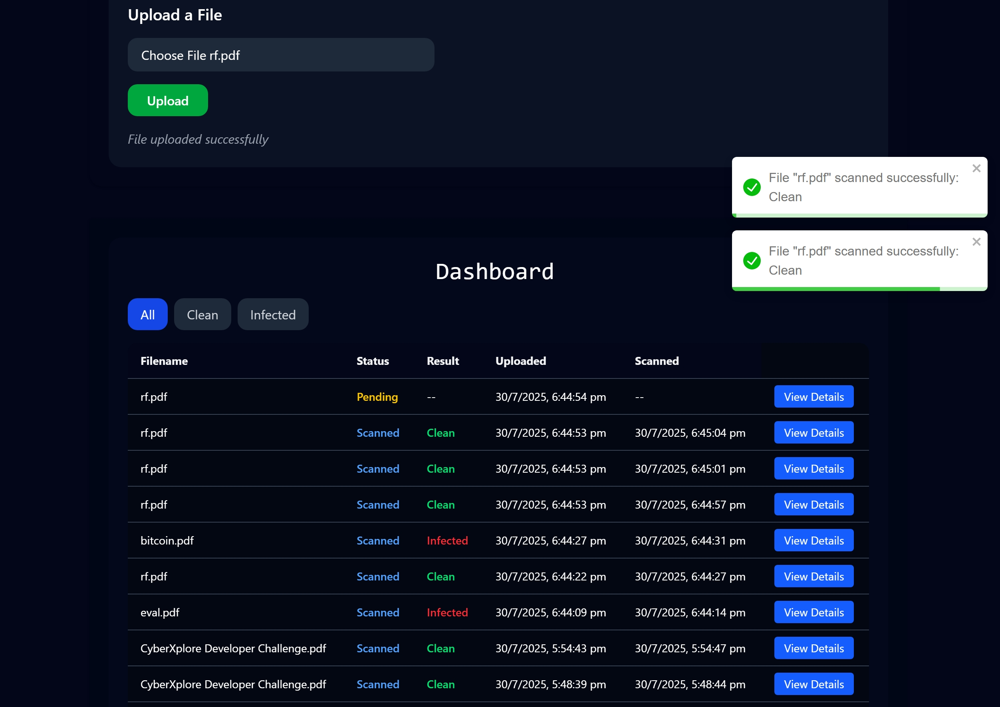
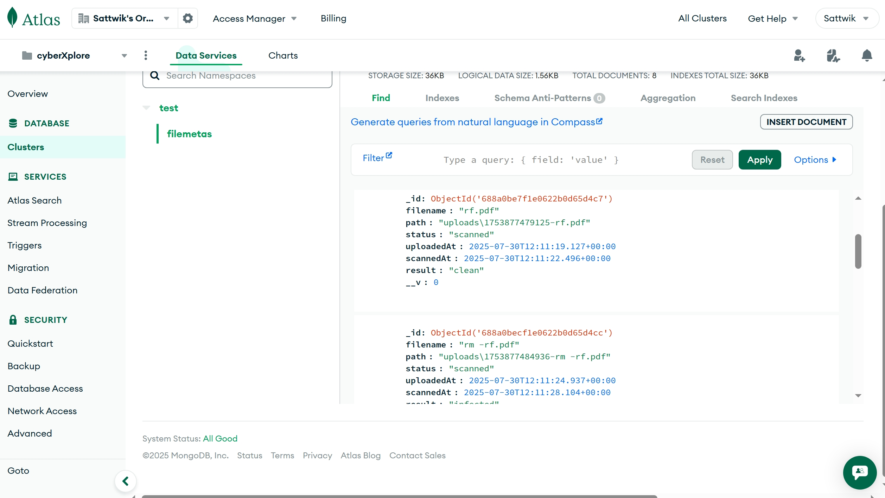
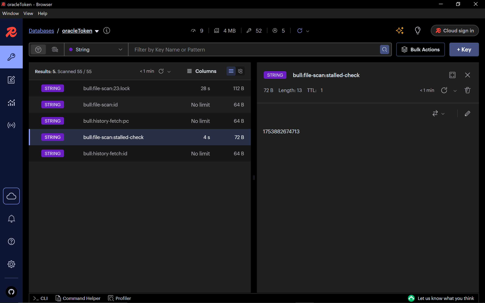

# CyberXplore
CyberXplore Secure File Upload & Malware Scanning
A modern full-stack system enabling secure file uploads, queuing, asynchronous malware scanning, and a real-time React dashboard. Bonus features include filtering, pagination, toast notifications, and webhook/Slack alerts for infected files.

## 📊 Dashboard Preview





## Db Preview



## redis And BullmQ





## ✨ Features
- Upload and scan `PDF`, `DOCX`, `JPG`, `PNG` files (max `5MB`)

- Files processed via queue (`BullMQ`/`Redis`)

- Background simulated malware scanning

- Responsive React dashboard

- Real-time updates (auto-refresh or instant with sockets)

- Status filter (clean/infected/pending), details modal, pagination

- Toast notifications for scan completion


## 🗂 Tech Stack
Backend: Node.js (TypeScript), Express.js

Frontend: React

Database: MongoDB

Queue: BullMQ (uses Redis)


## 🚀 Setup Instructions
### 1. Prerequisites
   - Node.js (v18+ recommended)

   - npm or yarn

   - MongoDB (local or cloud, running on default port)

   - Redis (running locally or using a cloud service)


### 2. Clone the Repository
```bash
git clone https://github.com/Sattwik13/CyberXplore.git
cd cyberxplore-malware-scan
```
### 3. Backend Setup
```bash
cd server
npm install            # Install backend dependencies
cp .env.example .env   # Edit .env with your credentials
```
#### .env file example:

```bash
MONGO_URI=mongodb://localhost:27017/cyberxplore
PORT=5000
REDIS_URL=redis://127.0.0.1:6379
```
`Note: Local Redis is required for BullMQ queue.`

`On Mac: brew install redis && redis-server`

`On Ubuntu: sudo apt install redis-server && redis-server`

#### Start MongoDB & Redis
- `MongoDB`:
 use MongoDB Compass/Atlas

- `Redis`:
 redis-server


#### Run Backend Server
```bash
npm run dev    # Uses nodemon + ts-node for TypeScript hot reload
# OR for one-off run:
npx ts-node src/index.ts
```
### 4. Frontend Setup
In a new terminal tab/window:

```bash
cd client
npm install        # Install frontend dependencies
npm start          # Start React/Vite dev server
```
App will be available at `http://localhost:3000` (or as displayed in your terminal).


### 5. Queue / Worker
The scanning worker is started automatically from within the backend (`src/scannerWorker.ts` imported in `src/index.ts`).

No separate process is needed.

All scan jobs use `BullMQ` and `Redis` for reliable queueing.

---

## 🤖 How Scanning is Simulated

- When a file is uploaded, metadata is stored in MongoDB with status: "pending", and a scan job is enqueued.

- The scan worker picks jobs off the queue using BullMQ.

- #### Simulated malware scan:

   - Waits 2–5 seconds (setTimeout() with a random delay).

   - Scans for "dangerous keywords" (e.g., rm -rf, eval, bitcoin) in the file path (for real scans, you'd check file content).

   - If any keyword is found, marks file as infected.

   - Otherwise, marks as clean.

- Updates metadata in MongoDB with status: "scanned", result, and scannedAt timestamp.

- Optionally, sends alert notifications if a file is infected (to Slack/webhook).
---

### 🖥️ How to Run Locally (Step-by-Step)

1. Start MongoDB and Redis servers

   - Ensure both are running.

2. Start Backend

   - cd server && npm run dev

   - Runs Express server with queue/workers baked in.

3. Start Frontend

   - Open new terminal:
     `cd client && npm start`

   - Visit your browser at `http://localhost:5173`

4. Upload Files via UI

    - Go to "Upload" page, select files, submit.

    - Dashboard auto-refreshes every few seconds to show real-time scan status.
---

## 🧪 Sample .env
```text
MONGO_URI=mongodb://localhost:27017/cyberxplore
PORT=5000
REDIS_URL=redis://127.0.0.1:6379
SLACK_WEBHOOK_URL= # Optional Slack notifications
WEBHOOK_URL=       # Optional webhook notifications
```
---
## 📝 Troubleshooting

- Make sure MongoDB and Redis are running and connectable.

- For large/many files, consider increasing Node.js memory limit if needed.

- If you want to demo with hosted Redis, set REDIS_URL to the remote instance.

##  Author
Sattwik Manna
